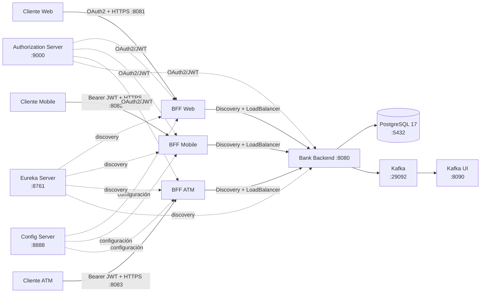

# 🏦 BancoXYZ — Microservicios, OAuth2, resiliencia y mensajería con Spring Cloud

> **Desarrollo Backend III (PBY2203) · Semana 8 · Grupo 13**  
> Arquitectura distribuida, OAuth2.0, Docker, Docker Compose, Resilience4j, Kafka y observabilidad.

---

## ✨ Resumen

BancoXYZ evoluciona la solución de microservicios construida en las semanas anteriores hacia una arquitectura preparada para una ejecución reproducible mediante contenedores y con seguridad basada en **OAuth2.0**.

La solución conserva `bank-backend` como API bancaria central sobre PostgreSQL y mantiene tres **Backend for Frontend (BFF)** independientes:

- BFF Web
- BFF Mobile
- BFF ATM

La configuración de los BFF continúa centralizada mediante **Spring Cloud Config Server**, los servicios se registran mediante **Eureka Service Discovery** y la comunicación con `bank-backend` utiliza resolución mediante Discovery y Spring Cloud LoadBalancer.

Para Semana 8 se incorporan:

- **Authorization Server OAuth2** mediante `auth-server`.
- **OAuth2 Login** para BFF Web.
- **OAuth2 Resource Server / JWT** para los servicios protegidos.
- **Dockerfiles** para los microservicios Java.
- **Docker Compose** para orquestar el entorno completo.
- **Resilience4j** con Circuit Breaker, Retry, Rate Limiter, timeout y fallback.
- **Apache Kafka** para mensajería.
- **Kafka UI** para inspección visual del broker y topics.
- **Spring Boot Actuator** para observabilidad.
- Evidencias funcionales mediante navegador, consola y Postman.

---

## ✅ Estado funcional validado

| Capacidad | Estado | Evidencia |
|---|:---:|---|
| OAuth2 Authorization Server | ✅ | `auth-server` operativo en `:9000` |
| OAuth2 Login BFF Web | ✅ | Flujo de login con usuario `usuario` y acceso a `/api/web/cuentas` |
| OAuth2 Resource Server | ✅ | Endpoints protegidos aceptan Bearer Token válido |
| Postman + Bearer Token | ✅ | `GET http://127.0.0.1:8080/api/cuentas` → `200 OK` |
| Config Server | ✅ | Configuración centralizada de los BFF |
| Eureka Service Discovery | ✅ | Servicios registrados y disponibles |
| Docker Compose | ✅ | Stack levantado y saludable |
| PostgreSQL | ✅ | Contenedor saludable y datos disponibles |
| Resilience4j | ✅ | Caída del backend → `503`; recuperación → `200` |
| Circuit Breaker / Retry / Rate Limiter | ✅ | Configuración centralizada y mecanismos activos |
| Kafka | ✅ | Broker operativo |
| Kafka UI | ✅ | Cluster `bancoxyz` Online, 1 broker, 2 topics y 51 partitions observados |
| Actuator | ✅ | Health y endpoints de observabilidad disponibles |
| Recuperación del backend | ✅ | `bank-backend` detenido y posteriormente recuperado correctamente |

---

## 🧭 Arquitectura



---

## 🧩 Componentes y puertos

| Componente | Puerto | Protocolo | Responsabilidad |
|---|---:|---|---|
| Authorization Server | `9000` | HTTP | Emisión de tokens OAuth2 y endpoints OIDC |
| Config Server | `8888` | HTTP | Configuración centralizada |
| Eureka Server | `8761` | HTTP | Registro y descubrimiento |
| Bank Backend | `8080` | HTTP | API bancaria central |
| BFF Web | `8081` | HTTPS | Contrato para canal Web |
| BFF Mobile | `8082` | HTTPS | Contrato reducido para Mobile |
| BFF ATM | `8083` | HTTPS | Operaciones de cajero |
| PostgreSQL | `5432` | TCP | Persistencia |
| Kafka | `9092` / `29092` | TCP | Mensajería |
| Kafka UI | `8090` | HTTP | Administración y visualización de Kafka |

Dentro de Docker, los servicios utilizan `kafka:29092` para comunicarse con Kafka.

---

## 🔐 Seguridad OAuth2.0

### Authorization Server

El proyecto incorpora `auth-server` como servidor de autorización OAuth2 en:

```text
http://localhost:9000
```

El servidor utiliza un par RSA para firmar los JWT y publica su JWK Set en:

```text
http://localhost:9000/oauth2/jwks
```

El flujo OAuth2 utiliza Authorization Code y se configuró un cliente específico para Postman.

### Usuario académico

```text
usuario
123456
```

### Cliente Postman

```text
Client ID:     bancoxyz-postman
Client Secret: bancoxyz-postman-secret
Callback:
https://oauth.pstmn.io/v1/browser-callback
```

### Cliente BFF Web

```text
Client ID: bancoxyz-client
Redirect URI:
https://127.0.0.1:8081/login/oauth2/code/bancoxyz-client
```

### Evidencia funcional

Se obtuvo un token OAuth2 y se utilizó como Bearer Token desde Postman contra:

```text
GET http://127.0.0.1:8080/api/cuentas
```

Resultado observado:

```text
200 OK
```

La respuesta contiene datos reales de las cuentas, demostrando autenticación mediante token y acceso a un endpoint protegido.

---

## 🛡️ Resilience4j

Los BFF utilizan la instancia:

```text
bankbackend
```

### Circuit Breaker

Configuración principal:

```properties
sliding-window-type=COUNT_BASED
sliding-window-size=5
minimum-number-of-calls=3
failure-rate-threshold=50
wait-duration-in-open-state=10s
permitted-number-of-calls-in-half-open-state=2
automatic-transition-from-open-to-half-open-enabled=true
```

### Retry

```properties
max-attempts=3
wait-duration=200ms
```

El Retry se aplica a fallos técnicos normalizados de las operaciones de lectura.

El retiro ATM no utiliza Retry automático porque no es una operación idempotente.

### Rate Limiter

```properties
limit-for-period=10
limit-refresh-period=1s
timeout-duration=0ms
```

### Timeout y fallback

```properties
backend.timeout=3s
```

Cuando `bank-backend` está disponible, el BFF puede entregar la respuesta normal.

Cuando `bank-backend` se detuvo durante la prueba, el BFF respondió:

```json
{
  "detail": "El Bank Backend no está disponible durante: obtener el listado de cuentas",
  "instance": "/api/web/cuentas",
  "status": 503,
  "title": "Bank Backend no disponible"
}
```

Posteriormente, al volver a levantar `bank-backend`, la misma operación volvió a responder correctamente con los datos de las cuentas.

Esta prueba demuestra el comportamiento controlado ante indisponibilidad y la recuperación del servicio.

---

## 📡 Kafka y Kafka UI

Semana 8 incorpora Apache Kafka como componente de mensajería.

El broker se ejecuta mediante:

```text
apache/kafka:4.0.0
```

Configuración interna:

```text
kafka:29092
```

Puerto externo:

```text
localhost:9092
```

### Kafka UI

Se agregó:

```text
provectuslabs/kafka-ui:latest
```

Acceso:

```text
http://localhost:8090
```

La interfaz quedó conectada al cluster:

```text
bancoxyz
```

Evidencia observada en Kafka UI:

```text
Estado: Online
Brokers: 1
Topics: 2
Partitions: 51
Offline clusters: 0
```

Kafka UI se utiliza como herramienta de observabilidad y evidencia visual del broker y sus topics.

---

## 📊 Observabilidad con Actuator

Los servicios exponen Spring Boot Actuator para salud y observabilidad.

Entre los endpoints utilizados se encuentran:

```text
/actuator/health
/actuator/info
/actuator/metrics
/actuator/circuitbreakers
/actuator/circuitbreakerevents
/actuator/retries
/actuator/retryevents
/actuator/ratelimiters
/actuator/ratelimiterevents
```

Los endpoints administrativos se mantienen protegidos según la configuración de seguridad de cada servicio.

---

## 📁 Estructura del proyecto

```text
bancoxyzbatch/
├── README.md
├── Propuesta_Tecnica.md
├── docker-compose.yml
├── .env.example
├── pom.xml
├── mvnw
├── .mvn/
└── Semana 8/
    ├── auth-server/
    ├── config-server/
    ├── discovery-server/
    ├── bank-backend/
    ├── config-repo/
    │   ├── bff-web.properties
    │   ├── bff-mobile.properties
    │   └── bff-atm.properties
    ├── bff/
    │   ├── bff-web/
    │   ├── bff-mobile/
    │   └── bff-atm/
    ├── database/
    ├── scripts/
    └── docs/
```

---

## 🐳 Docker

Cada microservicio Java dispone de su propio proceso de construcción mediante Docker.

Los servicios Java principales son:

```text
auth-server
config-server
discovery-server
bank-backend
bff-web
bff-mobile
bff-atm
```

La infraestructura adicional está compuesta por:

```text
postgres
kafka
kafka-ui
```

El `docker-compose.yml` define:

- red interna `bancoxyz-net`;
- healthchecks;
- dependencias condicionadas por salud;
- volumen persistente PostgreSQL;
- variables de entorno;
- montaje del repositorio de configuración;
- puertos externos;
- conexión interna de Kafka;
- Kafka UI.

---

## 🚀 Ejecución con Docker Compose

Desde la raíz del proyecto:

```powershell
docker compose config
```

Si la configuración es válida:

```powershell
docker compose up -d --build
```

Comprobar servicios:

```powershell
docker compose ps
```

Ver logs:

```powershell
docker compose logs -f
```

Levantar solamente Kafka y Kafka UI:

```powershell
docker compose up -d kafka kafka-ui
```

Acceder a Kafka UI:

```text
http://localhost:8090
```

Detener el stack:

```powershell
docker compose down
```

> `docker compose down -v` elimina también el volumen PostgreSQL y debe utilizarse solamente cuando se quiera reconstruir la base desde cero.

---

## 🧪 Verificaciones realizadas

### OAuth2

1. Inicio de sesión mediante Authorization Server.
2. Obtención de token.
3. Uso del token como Bearer Token en Postman.
4. Acceso a:

```text
GET http://127.0.0.1:8080/api/cuentas
```

5. Resultado:

```text
200 OK
```

### Resiliencia

1. `bank-backend` operativo.
2. Solicitud a `/api/web/cuentas` → datos correctos.
3. `bank-backend` detenido.
4. Solicitud a `/api/web/cuentas` → `503 Bank Backend no disponible`.
5. `bank-backend` iniciado nuevamente.
6. Solicitud posterior → datos correctos nuevamente.

### Kafka

Kafka UI mostró:

```text
Cluster bancoxyz: Online
1 broker
2 topics
51 partitions
0 clusters offline
```

---

## 📸 Evidencias recomendadas para la entrega

Se recomienda conservar capturas de:

1. `docker compose ps` mostrando los servicios saludables.
2. Auth Server funcionando.
3. Login OAuth2 del BFF Web.
4. Postman con Bearer Token y respuesta `200 OK`.
5. Caída de `bank-backend` y respuesta `503`.
6. Recuperación de `bank-backend` y respuesta normal.
7. Kafka UI mostrando el cluster `bancoxyz`.
8. Kafka UI mostrando los topics.
9. Eureka con los servicios registrados.
10. Actuator mostrando salud y mecanismos de resiliencia.

---

## 🎯 Correspondencia con la pauta de Semana 8

| Criterio | Implementación / evidencia |
|---|---|
| OAuth2.0 — 20 pts | Authorization Server, Authorization Code, JWT, BFF Web OAuth2 Login, Resource Server y prueba Postman |
| Docker — 20 pts | Dockerfiles para los microservicios Java y ejecución mediante contenedores |
| Docker Compose — 20 pts | Orquestación del stack completo, healthchecks, dependencias, red y volumen |
| Resilience4j — 20 pts | Circuit Breaker, Retry, Rate Limiter, timeout y fallback; prueba de caída y recuperación |
| Kafka/JMS — 15 pts | Apache Kafka operativo y Kafka UI conectado al broker |
| Código, documentación y evidencias — 5 pts | Código fuente, README, Propuesta Técnica y capturas funcionales |

---

## ☁️ Ejecución en entorno Cloud

La solución queda preparada para ser trasladada a un entorno Cloud mediante Docker Compose.

La estrategia de despliegue considera una instancia AWS EC2 dedicada para la evaluación, utilizando Docker como runtime y manteniendo la misma composición de servicios.

La validación realizada hasta este punto corresponde al entorno local. La ejecución en la nueva instancia EC2 se documentará como una etapa posterior del despliegue.

---

## 🧠 Decisiones técnicas destacadas

- OAuth2.0 reemplaza el esquema anterior de tokens académicos como mecanismo principal de seguridad.
- `auth-server` centraliza la emisión y validación de credenciales OAuth2.
- BFF Web utiliza OAuth2 Login y sesión autenticada.
- Los servicios protegidos utilizan JWT como Resource Server.
- Config Server mantiene las políticas operativas fuera del código.
- Eureka evita acoplamiento directo por IP entre microservicios.
- Retry se limita a operaciones de lectura seguras.
- El retiro ATM no utiliza Retry automático por su naturaleza no idempotente.
- Rate Limiter limita exceso de tráfico antes de afectar el Circuit Breaker.
- Fallback entrega respuestas HTTP semánticas ante fallos técnicos.
- Kafka desacopla la mensajería del ecosistema.
- Kafka UI facilita la observación del broker durante la evaluación.
- Docker Compose permite reproducir el entorno completo.
- Actuator permite observar salud y estado operativo.

---

## 📌 Nota académica

Los usuarios, secretos, certificados y demás valores de configuración utilizados durante la demostración son exclusivamente académicos.

En un entorno productivo se recomienda utilizar:

- OAuth2/OIDC con un proveedor de identidad administrado;
- secretos mediante un Secret Manager;
- certificados emitidos por una CA confiable;
- TLS interno entre servicios;
- observabilidad centralizada;
- trazabilidad distribuida;
- CI/CD;
- configuración separada por ambientes.

---

**BancoXYZ · Semana 8 — Microservicios, OAuth2.0, resiliencia, Docker y Kafka.**
